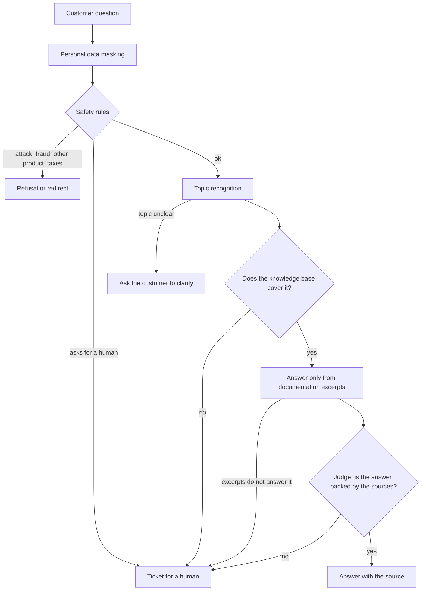

# kremzaPay Support Bot

[](https://github.com/aleksykremza-dev/kremzapay-support-bot/actions/workflows/ci.yml)
[](https://github.com/aleksykremza-dev/kremzapay-support-bot/releases)

A support bot engine that answers customers from your own documentation and
does not make things up. When it does not know the answer, it says so and opens
a ticket for a human.

[Wersja polska](README.md) · Detailed documentation in `docs/` is in Polish.

## Why

I built this engine because a typical LLM chatbot answers confidently even when
it has no idea. In payment support that is expensive: wrong information about a
refund ends in a complaint. I wanted a bot that would rather say "I'm passing
this to a consultant" than invent an answer.

So every answer goes through several checks before it reaches the customer, and
each of them can stop the conversation and hand it to a human. The example
domain is online payment support; `kremzaPay` is a working name.

## How it works



- **Personal data** (card, IBAN, PESEL, phone, e-mail) is replaced with labels
  before the model, the log or the database sees the text.
- **Rules** catch attempts to manipulate the bot and requests for help with
  fraud without calling the model, in a fraction of a millisecond.
- **Topic** is recognised by comparing the question with 5412 labelled questions.
  The language model is called only when similar questions do not agree.
- **The answer** is built only from the three best documentation excerpts and
  ends with a `Źródło: <article id>` line.
- **The judge**, a second model call, checks that the excerpts answer this exact
  question and that every claim in the answer is backed by them.

## Results

Measured on 02.10 and 04.10.2026 with `qwen2.5:7b-instruct` on a GTX 1050 Ti 4 GB:

| What | Result |
|---|---|
| Questions outside the knowledge base that ended in a ticket, not an invented answer | 15 of 15 |
| Questions covered by the base that the bot answered | 54 of 85, 42 of them citing the right article; the rest were passed on |
| Topic accuracy on the test part of the control set (192 questions) | 0.755 |
| Median response time | 14.4 s (almost all of it is the model; rules, topic and search take about 0.3 s) |
| Stability, 20 minutes with a request every 20 s | memory +0.0 MB, open files 10 -> 10 |
| Tests | 174 unit tests in CI on every change; live tests: out-of-scope 22/22, topic recognition 54/56 |

The external-base measurement used 59 articles from the same domain but different
from the corpus the topic recognition was built on, and 100 questions in Polish.

## Quick start

You need Docker with Compose, [Ollama](https://ollama.com) with the model
(`ollama pull qwen2.5:7b-instruct`) and articles in `kb/`.

```bash
git clone https://github.com/aleksykremza-dev/kremzapay-support-bot.git && cd kremzapay-support-bot
make up
make ingest
```

Chat: http://localhost:8020, dashboard: http://localhost:8020/dashboard, API docs:
http://localhost:8020/docs. Prebuilt image:
`docker pull ghcr.io/aleksykremza-dev/kremzapay-support-bot:1.0.0`.

An article is a Markdown file `kb/<category>/<id>.md` with a short header
(`id`, `category`, `title`); run `make ingest` after every change.

## Handing over to a human

When the customer asks for a consultant, the ticket gets high priority and the
bot stops answering in that conversation: further messages are added to the
ticket. The bot asks for an e-mail or phone number and stores the original only
in the ticket. The dashboard shows a "Czeka na człowieka" (waiting for a human)
queue with a counter and a close button.

## Defaults and how to extend

| | Default | Extension |
|---|---|---|
| Model | local Ollama, `qwen2.5:7b-instruct`, no token cost | another Ollama model via `ANSWER_MODEL` (available); a hosted LLM such as an OpenAI-compatible API needs a change in one module, `src/llm.py`; at high traffic this is a cost either way: own GPUs or a paid API |
| Languages | Polish and English | the models are multilingual, but a new language needs language detection, reply texts, rule patterns and example questions; a translation layer is planned |
| Knowledge | Markdown in `kb/` | PDF, website, REST, Confluence: planned |
| Domain | payments as an example | own taxonomy, corpus and control set (available); swappable domain packages planned |
| Traffic | 2 questions at a time on a GTX 1050 Ti, extra requests wait up to 30 s, then get 503 with a ticket | the limit is set in `.env` for stronger hardware (available); vLLM, several workers and Postgres for 1000+ questions per hour planned |
| Dashboard | no login, local use only | login and roles planned |
| Tickets | SQLite and the dashboard | e-mail, helpdesk, CRM planned |

## Limitations

- The dashboard and ticket closing have no login: run them locally or behind your
  own authentication.
- On a weak GPU an answer takes from a few seconds to about 35 seconds.
- Topic accuracy is 0.755; the target for the next version is 0.85.
- Answer text quality is only controlled by the yes/no judge, it is not measured
  separately.

## Why there is no knowledge base in the repository

The engine was developed on real documentation that belongs to its owner, so it
is not published. The repository contains the engine and instructions for
connecting your own articles.

## License

[PolyForm Noncommercial 1.0.0](LICENSE), Copyright (c) 2026 Oleksii Kremza.
Commercial use requires prior written permission from the copyright holder.
