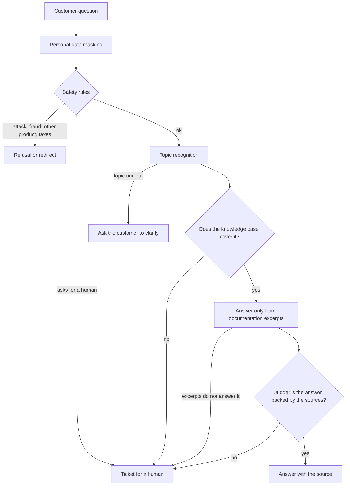

# kremzaPay Support Bot

[](https://github.com/aleksykremza-dev/kremzapay-support-bot/actions/workflows/ci.yml)
[](https://github.com/aleksykremza-dev/kremzapay-support-bot/releases)

A bot engine that answers only from the documents you give it: terms and
conditions, regulations, company procedures, product manuals. Every answer cites
its source, and when the documents do not contain the answer, the bot says so and
opens a ticket for a human.

The engine is not tied to one industry. The domain is set by a set of topics and
example questions; the repository ships an example for online payment support.

[Wersja polska](README.md) · Detailed documentation in `docs/` is in Polish.

## Why

I built this engine because a typical LLM chatbot answers confidently even when
it has no idea. In payment support that is expensive: wrong information about a
refund ends in a complaint. I wanted a bot that would rather say "I'm passing
this to a consultant" than invent an answer.

So every answer goes through several checks before it reaches the customer, and
each of them can stop the conversation and hand it to a human. Payments are only
the example the engine was built and measured on; `kremzaPay` is a working name.

## How it works



- **Personal data** (card, IBAN, PESEL, phone, e-mail) is replaced with labels
  before the model, the log or the database sees the text.
- **Rules** catch attempts to manipulate the bot and requests for help with
  fraud without calling the model, in a fraction of a millisecond.
- **Topic** is recognised by a classifier trained on 5412 labelled questions
  (`multilingual-e5-large` embeddings and logistic regression). The language model
  is called only when the classifier is not confident.
- **The answer** is built only from the three best documentation excerpts and
  ends with a `Źródło: <article id>` line.
- **The judge**, a second model call, checks that the excerpts answer this exact
  question and that every claim in the answer is backed by them.

## Results

Measured on 04.10.2026 with `qwen2.5:7b-instruct` on a GTX 1050 Ti 4 GB:

| What | Result |
|---|---|
| Questions outside the knowledge base that ended in a ticket, not an invented answer | 15 of 15 |
| Questions covered by the base that the bot answered | 54 of 85, 39 of them citing the right article; the rest were passed on |
| Topic accuracy (52 topics and 4 special classes) | **91%** on all 288 control questions; **89.1%** on the 192 questions the model did not see during tuning; 94.8% on the 96 questions used to tune the settings |
| Median response time | 10.2 s (almost all of it is the model; rules, topic and the knowledge check take about 0.15 s) |
| Stability, 20 minutes with a request every 20 s | memory +4.2 MB (2250 -> 2254 MB), open files 9 -> 9 |
| Tests | 209 unit tests in CI on every change; live tests: out-of-scope 22/22, topic recognition 55/56 |

The external-base measurement used 59 articles from the same domain but different
from the corpus the topic recognition was built on, and 100 questions in Polish.

Topic accuracy went from 75.5% to 89.1% (on questions not seen during tuning)
after replacing similar-question voting with a trained classifier and a stronger
embedding model. Indirect questions gained the most (from 32 to 43 of 52), then
emotional ones (from 40 to 51 of 56).

### How to raise accuracy further

- **Answer automatically only when confident**, otherwise ask a clarifying
  question or hand over to a human; measure accuracy of automatic answers together
  with the share of questions the bot handles alone (target: 98 to 99% at a known
  share).
- **Operator corrections as new data:** a "wrong topic" button in the dashboard;
  reviewed corrections go into the corpus.
- **Merge topics that lead to the same answer**, e.g. API errors and webhook
  retries, account data changes and team roles.
- **Fine-tune a small model** (e.g. SetFit) on the same 5412 questions instead of
  logistic regression.
- **Two independent classifiers:** when they disagree, the bot asks.

## Quick start

You need Docker with Compose, [Ollama](https://ollama.com) with the model
(`ollama pull qwen2.5:7b-instruct`) and articles in `kb/`.

```bash
git clone https://github.com/aleksykremza-dev/kremzapay-support-bot.git && cd kremzapay-support-bot
make up
make ingest
```

Chat: http://localhost:8020, dashboard: http://localhost:8020/dashboard, API docs:
http://localhost:8020/docs. Prebuilt image:
`docker pull ghcr.io/aleksykremza-dev/kremzapay-support-bot:1.0.0`.

An article is a Markdown file `kb/<category>/<id>.md` with a short header
(`id`, `category`, `title`); run `make ingest` after every change.

## Handing over to a human

When the customer asks for a consultant, the ticket gets high priority and the
bot stops answering in that conversation: further messages are added to the
ticket. The bot asks for an e-mail or phone number and stores the original only
in the ticket. The dashboard shows a "Czeka na człowieka" (waiting for a human)
queue with a counter and a close button.

## Defaults and how to extend

| | Default | Extension |
|---|---|---|
| Model | local Ollama, `qwen2.5:7b-instruct`, no token cost | another Ollama model via `ANSWER_MODEL` (available); a hosted LLM such as an OpenAI-compatible API needs a change in one module, `src/llm.py`; at high traffic this is a cost either way: own GPUs or a paid API |
| Languages | Polish and English | the models are multilingual, but a new language needs language detection, reply texts, rule patterns and example questions; a translation layer is planned |
| Knowledge | Markdown in `kb/` | PDF, website, REST, Confluence: planned |
| Domain | payments as an example: 52 topics, 5412 example questions, rules and reply texts | another domain (e.g. law, HR procedures) needs its own set of topics, examples and reply texts (the format is documented); a document base alone is not enough; swappable domain packages planned |
| Traffic | 2 questions at a time on a GTX 1050 Ti, extra requests wait up to 30 s, then get 503 with a ticket | the limit is set in `.env` for stronger hardware (available); vLLM, several workers and Postgres for 1000+ questions per hour planned |
| Dashboard | no login, local use only | login and roles planned |
| Tickets | SQLite and the dashboard | e-mail, helpdesk, CRM planned |

## Limitations

- The dashboard and ticket closing have no login: run them locally or behind your
  own authentication.
- On a weak GPU an answer takes from a few seconds to about 35 seconds.
- Topic accuracy is 89.1% on questions not seen during tuning, so about 1 in 9
  questions lands in the wrong topic; next steps are in "How to raise accuracy
  further".
- Answer text quality is only controlled by the yes/no judge, it is not measured
  separately.

## From a laptop to a company deployment

This version runs on one computer, but it is not a one-computer toy. Every part
can be replaced with a stronger one without rewriting the rest, because each
external dependency has a single place in the code:

- **The model in one module.** All LLM calls go through `src/llm.py`. Moving from
  local Ollama to vLLM on your own GPUs or to a hosted model (e.g. Azure OpenAI)
  changes this one file.
- **Data in one module.** Sessions, messages and tickets are written only by
  `src/store.py`; SQLite is swapped for Postgres there.
- **No conversation state in API memory.** History lives in the database, so
  several engine copies can run behind a load balancer.
- **Safe behaviour on failure:** missing knowledge gives a ticket instead of an
  invented answer; overload and service outages give 503 with a ticket number.
- **Personal data masked** before the model, logs and database.
- **Ready to deploy:** Docker image (non-root, healthcheck), CI on every change,
  an accuracy gate that blocks regressions.

<picture>
  <source media="(prefers-color-scheme: dark)" srcset="docs/img/wdrozenie-dark.svg">
  
</picture>

Green: already in the engine and carried over without changes to its logic.
Purple dashed: parts to build around the engine. Diagram labels are in Polish.

| Area | Now | In a company | Status |
|---|---|---|---|
| Model | Ollama, 2 questions at a time | vLLM on GPUs or a hosted LLM, hundreds at a time | planned |
| Traffic | about 300 questions per hour on a GTX 1050 Ti (estimate) | 1000+ per hour, confirmed by measurement | planned |
| Data | SQLite | Postgres, backups, retention | planned |
| Access | dashboard without login | SSO, roles, API keys, audit log | planned |
| Domains | one domain in `data/` | a domain package per client | planned |
| Channels | web chat | website widget, e-mail, Teams, WhatsApp | planned |
| Tickets | SQLite and the dashboard | Zendesk, Jira, CRM | planned |
| Quality | accuracy gate in tests, answer judge | evaluation on every change, operator corrections become new data | partial |
| Monitoring | `/health`, timing of every step in the database | metrics, dashboards, alerts | partial |
| GDPR | personal data masking | retention, deletion on request, EU-only data | partial |
| Answer safety | rules, refusal instead of invention, handover to a human | the same | available |
| Deployment | Docker image, CI, public image in GHCR | plus orchestration (Kubernetes or Docker Swarm) | partial |

The step-by-step plan with code changes is in [docs/wdrozenie.md](docs/wdrozenie.md) (Polish).

## Why there is no knowledge base in the repository

The engine was developed on real documentation that belongs to its owner, so it
is not published. The repository contains the engine and instructions for
connecting your own articles.

## License

[PolyForm Noncommercial 1.0.0](LICENSE), Copyright (c) 2026 Oleksii Kremza.
Commercial use requires prior written permission from the copyright holder.
