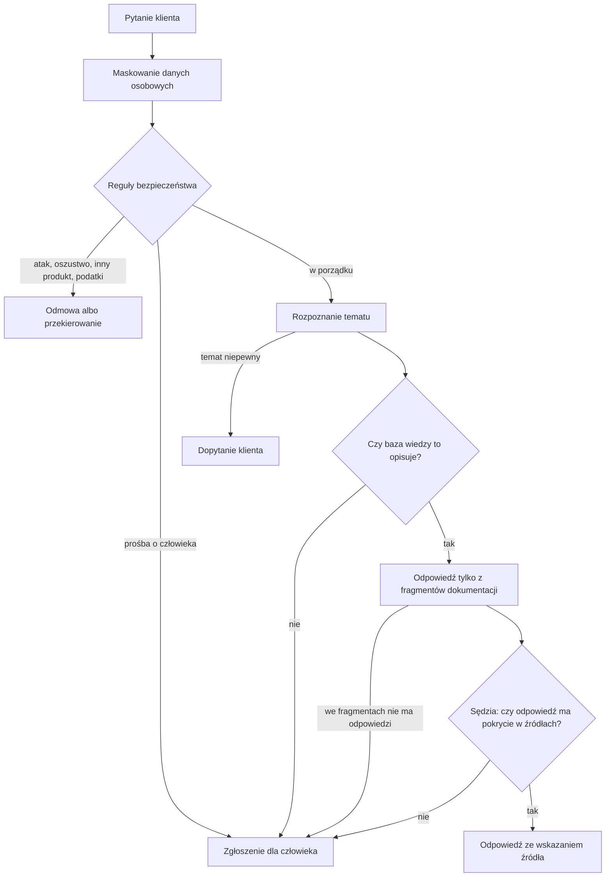
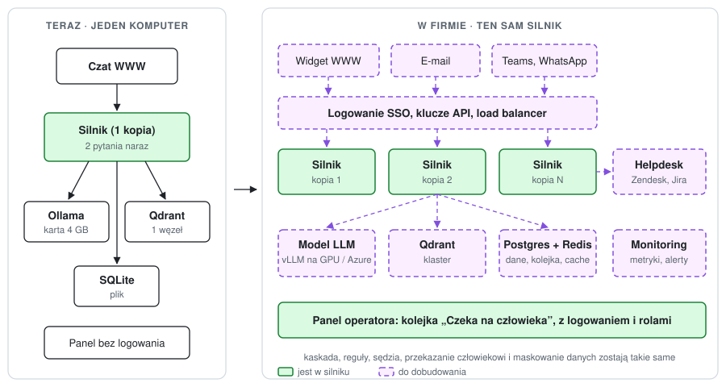

# kremzaPay Support Bot

[](https://github.com/aleksykremza-dev/kremzapay-support-bot/actions/workflows/ci.yml)
[](https://github.com/aleksykremza-dev/kremzapay-support-bot/releases)

Silnik bota, który odpowiada wyłącznie na podstawie dokumentów, które mu dasz:
regulaminów, przepisów, procedur firmy, instrukcji produktu. Do każdej odpowiedzi
podaje źródło, a gdy odpowiedzi w dokumentach nie ma, mówi to wprost i zakłada
zgłoszenie dla człowieka.

Silnik nie jest przypisany do jednej branży. Dziedzinę ustawia zestaw tematów
i przykładowych pytań; w repozytorium jest przykład dla obsługi płatności
internetowych.

[English version](README.en.md)

## Po co

Zrobiłem ten silnik, bo typowy czatbot na LLM odpowiada pewnie także wtedy, gdy
nie ma pojęcia. W obsłudze płatności to kosztuje: błędna informacja o zwrocie
kończy się reklamacją. Chciałem bota, który woli napisać „przekazuję sprawę
konsultantowi”, niż wymyślić odpowiedź.

Dlatego odpowiedź przechodzi kilka kontroli, zanim trafi do klienta, a każda
z nich może zatrzymać rozmowę i oddać ją człowiekowi. Płatności to tylko
przykład, na którym silnik był budowany i mierzony; `kremzaPay` to robocza
nazwa projektu.

## Jak to działa



- **Dane osobowe** (karta, IBAN, PESEL, telefon, e-mail) są zamieniane na
  etykiety, zanim tekst zobaczy model, log albo baza.
- **Reguły** łapią próby manipulacji botem i prośby o pomoc w oszustwie bez
  udziału modelu, w ułamku milisekundy.
- **Temat** rozpoznaje klasyfikator wytrenowany na 5412 opisanych pytaniach
  (embeddingi `multilingual-e5-large` i regresja logistyczna). Model językowy
  włącza się dopiero wtedy, gdy klasyfikator nie jest pewny.
- **Odpowiedź** powstaje wyłącznie z trzech najlepszych fragmentów dokumentacji
  i kończy się linią `Źródło: <id artykułu>`.
- **Sędzia**, czyli drugie wywołanie modelu, sprawdza, czy fragmenty odpowiadają
  właśnie na to pytanie i czy każde twierdzenie ma w nich oparcie.

Szczegóły, progi i pliki: [docs/architektura.md](docs/architektura.md).

## Wyniki

Pomiary z 04.10.2026 na `qwen2.5:7b-instruct` i karcie GTX 1050 Ti 4 GB:

| Co mierzę | Wynik |
|---|---|
| Pytania spoza bazy wiedzy, które skończyły się zgłoszeniem, a nie zmyśloną odpowiedzią | 15 z 15 |
| Pytania z bazy, na które bot odpowiedział | 54 z 85, z czego 39 ze wskazaniem właściwego artykułu; pozostałe przekazał dalej |
| Trafność rozpoznania tematu (52 tematy i 4 klasy specjalne) | **91%** na wszystkich 288 pytaniach kontrolnych; **89,1%** na 192 pytaniach, których model nie widział przy strojeniu; 94,8% na 96 pytaniach, na których dobierano ustawienia |
| Mediana czasu odpowiedzi | 10,2 s (prawie cały czas to model; reguły, temat i sprawdzenie bazy trwają około 0,15 s) |
| Stabilność, 20 minut z zapytaniem co 20 s | pamięć +4,2 MB (2250 -> 2254 MB), otwarte pliki 9 -> 9 |
| Testy | 209 testów jednostkowych w CI przy każdej zmianie, testy na żywo: pytania spoza zakresu 22/22, rozpoznanie tematów 55/56 |

Pomiar na zewnętrznej bazie: 59 artykułów z tej samej dziedziny, ale innych niż
korpus, na którym budowałem rozpoznawanie tematów, i 100 pytań po polsku.
Wszystkie testy i scenariusze: [docs/testy.md](docs/testy.md).

Trafność tematu wzrosła z 75,5% do 89,1% (na pytaniach niewidzianych przy
strojeniu) po zamianie głosowania podobnych pytań na wytrenowany klasyfikator
i mocniejszy model embeddingów. Najwięcej zyskały pytania napisane nie wprost
(z 32 do 43 na 52) i emocjonalne (z 40 do 51 na 56).

### Jak podnieść trafność dalej

- **Odpowiadać samodzielnie tylko przy wysokiej pewności**, a resztę dopytywać
  albo przekazywać człowiekowi; mierzyć trafność odpowiedzi automatycznych
  razem z udziałem pytań, które bot obsługuje sam (cel: 98 do 99% przy znanym
  udziale).
- **Poprawki operatorów jako nowe dane:** przycisk „temat był inny” w panelu, po
  przeglądzie poprawione pytania trafiają do korpusu.
- **Scalenie tematów, które prowadzą do tej samej odpowiedzi**, np. błędy API
  i ponawianie webhooków, zmiana danych konta i role w zespole.
- **Dostrojenie małego modelu** (np. SetFit) na tych samych 5412 pytaniach
  zamiast regresji logistycznej.
- **Dwa niezależne klasyfikatory:** gdy wskażą różne tematy, bot dopytuje.

## Szybki start

Potrzebne: Docker z Compose, [Ollama](https://ollama.com) z modelem
(`ollama pull qwen2.5:7b-instruct`) i artykuły w `kb/` (sekcja „Własna
dokumentacja” niżej).

```bash
git clone https://github.com/aleksykremza-dev/kremzapay-support-bot.git && cd kremzapay-support-bot
make up
make ingest
```

Czat: http://localhost:8020, panel: http://localhost:8020/dashboard, opis API:
http://localhost:8020/docs. Gotowy obraz:
`docker pull ghcr.io/aleksykremza-dev/kremzapay-support-bot:1.0.0`.

Pierwszy start trwa około 2 minut (pobranie modeli embeddingów, około 2,4 GB;
indeks tematów jest gotowy w repozytorium), kolejne kilkanaście sekund. Ollama w WSL, Ollama w kontenerze i instalacja bez
Dockera: [docs/instalacja.md](docs/instalacja.md).

## Własna dokumentacja

Artykuł to plik Markdown `kb/<kategoria>/<id>.md` z krótkim nagłówkiem:

```
---
id: KB-030
category: refunds
title: Gdzie jest mój zwrot
---

Zwrot na kartę trwa zwykle od 3 do 7 dni roboczych od zlecenia przez sprzedawcę.
```

Po każdej zmianie w artykułach: `make ingest`. Pełny format, kategorie
i przygotowanie bota pod inną dziedzinę niż płatności:
[docs/wlasna-domena.md](docs/wlasna-domena.md).

## Przekazanie człowiekowi

Gdy klient prosi o konsultanta albo bot nie ma pewnej odpowiedzi, powstaje zgłoszenie,
a klient dostaje jego numer. Przy prośbie o człowieka:

- zgłoszenie ma priorytet wysoki, a bot w tej rozmowie milknie: kolejne
  wiadomości klienta dopisują się do zgłoszenia;
- bot prosi o e-mail albo telefon i zapisuje je w oryginale tylko w zgłoszeniu,
  nigdzie indziej;
- w panelu na górze jest kolejka „Czeka na człowieka” z licznikiem i przyciskiem
  „Zamknij”.

Szczegóły i API: [docs/api.md](docs/api.md).

## Domyślnie i jak rozszerzyć

| | Domyślnie | Rozszerzenie |
|---|---|---|
| Model | lokalna Ollama, `qwen2.5:7b-instruct`, 0 zł za tokeny | inny model z Ollama jedną zmienną `ANSWER_MODEL` (jest); hostowany LLM, np. zgodny z OpenAI, wymaga zmiany jednego modułu `src/llm.py`; przy dużym ruchu to już koszt: własne GPU albo płatne API |
| Języki | polski i angielski | modele są wielojęzyczne, ale nowy język wymaga wykrywania języka, tekstów odpowiedzi, wzorców reguł i przykładowych pytań; warstwa tłumaczenia w planie |
| Wiedza | Markdown w `kb/` | PDF, strona WWW, REST, Confluence: w planie |
| Dziedzina | płatności jako przykład: 52 tematy, 5412 przykładowych pytań, reguły i teksty odpowiedzi | inna dziedzina (np. przepisy prawa, procedury HR) wymaga własnego zestawu tematów i przykładów oraz tekstów odpowiedzi (format jest, [opis](docs/wlasna-domena.md)); sama baza dokumentów bez tego zestawu nie wystarczy; wymienne pakiety dziedzin w planie |
| Ruch | 2 pytania naraz na GTX 1050 Ti, nadmiar czeka do 30 s, potem dostaje 503 ze zgłoszeniem | limit w `.env` na mocniejszym sprzęcie (jest); vLLM, kilka procesów i Postgres dla 1000+ pytań na godzinę w planie |
| Panel | bez logowania, tylko lokalnie | logowanie i role w planie |
| Zgłoszenia | SQLite i panel | e-mail, helpdesk, CRM w planie |

## Ograniczenia

- Panel i zamykanie zgłoszeń nie mają logowania: uruchamiaj lokalnie albo za
  własnym uwierzytelnianiem.
- Na słabej karcie odpowiedź trwa od kilku do około 35 sekund.
- Trafność rozpoznania tematu 89,1% na pytaniach niewidzianych przy strojeniu,
  czyli około 1 na 9 pytań trafia do złego tematu; dalsze kroki w „Jak podnieść
  trafność dalej”.
- Jakość tekstu odpowiedzi kontroluje tylko sędzia tak/nie, nie jest osobno mierzona.

Pełna lista: [docs/architektura.md](docs/architektura.md#ograniczenia).

## Od laptopa do wdrożenia w firmie

Ta wersja działa na jednym komputerze, ale nie jest zabawką na jeden komputer.
Każdą część silnika da się wymienić na mocniejszą bez przepisywania reszty, bo
każda zależność zewnętrzna ma w kodzie jedno miejsce.

Co już jest gotowe pod większą skalę:

- **Model w jednym module.** Wszystkie wywołania LLM idą przez `src/llm.py`.
  Przejście z lokalnej Ollamy na vLLM na własnych GPU albo na hostowany model
  (np. Azure OpenAI) zmienia ten jeden plik.
- **Dane w jednym module.** Sesje, wiadomości i zgłoszenia zapisuje tylko
  `src/store.py`. SQLite zamienia się na Postgres w tym miejscu.
- **API bez stanu rozmowy w pamięci.** Historia jest w bazie, więc można
  uruchomić kilka kopii silnika za load balancerem.
- **Bezpieczne zachowanie przy błędach:** brak wiedzy daje zgłoszenie zamiast
  zmyślenia, przeciążenie i awaria usług dają 503 z numerem zgłoszenia.
- **Dane osobowe maskowane** przed modelem, logami i bazą; kontakt klienta tylko
  w zgłoszeniu.
- **Gotowe do wdrożenia:** obraz Docker (bez roota, z healthcheckiem), CI z testami
  przy każdej zmianie, bramka trafności, która blokuje pogorszenie.

<picture>
  <source media="(prefers-color-scheme: dark)" srcset="docs/img/wdrozenie-dark.svg">
  
</picture>

Zielone: to, co już jest w silniku i przechodzi do wersji dla firmy bez zmian
w logice. Fioletowe przerywane: części do dobudowania wokół silnika.

| Obszar | Teraz | W firmie | Status |
|---|---|---|---|
| Model | Ollama, 2 pytania naraz | vLLM na GPU albo hostowany LLM, setki pytań naraz | w planie |
| Ruch | ok. 300 pytań na godzinę na GTX 1050 Ti (szacunek) | 1000+ pytań na godzinę, potwierdzone pomiarem | w planie |
| Dane | SQLite | Postgres, kopie zapasowe, czas przechowywania | w planie |
| Dostęp | panel bez logowania | SSO, role (operator, administrator), klucze API, dziennik działań | w planie |
| Dziedziny | jedna dziedzina w plikach `data/` | osobny pakiet dziedziny dla każdego klienta | w planie |
| Kanały | czat WWW | widget na stronę, e-mail, Teams, WhatsApp | w planie |
| Zgłoszenia | SQLite i panel | Zendesk, Jira, CRM | w planie |
| Jakość | bramka trafności w testach, sędzia odpowiedzi | ocena przy każdej zmianie, poprawki operatorów wracają jako nowe dane | częściowo |
| Monitoring | `/health`, czas każdego kroku w bazie | metryki, wykresy, alerty (np. rośnie udział zgłoszeń) | częściowo |
| RODO | maskowanie danych osobowych | czas przechowywania, usuwanie na żądanie, dane tylko w UE | częściowo |
| Bezpieczeństwo odpowiedzi | reguły, odmowa zamiast zmyślenia, przekazanie człowiekowi | to samo | jest |
| Wdrożenie | obraz Docker, CI, publiczny obraz w GHCR | to samo plus orkiestracja (Kubernetes albo Docker Swarm) | częściowo |

Szczegóły, kolejność kroków i co dokładnie zmienia się w kodzie:
[docs/wdrozenie.md](docs/wdrozenie.md).

## Dlaczego w repozytorium nie ma bazy wiedzy

Silnik był rozwijany na prawdziwej dokumentacji, która należy do jej właściciela,
dlatego nie jest publikowana. Repozytorium zawiera silnik i instrukcję
podłączenia własnych artykułów.

## Dokumentacja

| Plik | Co w nim jest |
|---|---|
| [docs/architektura.md](docs/architektura.md) | etapy krok po kroku, progi, koszt jednego pytania, ograniczenia, mapa kodu |
| [docs/instalacja.md](docs/instalacja.md) | wymagania, instalacja bez Dockera, zmienne `.env`, Ollama w WSL i w kontenerze |
| [docs/wlasna-domena.md](docs/wlasna-domena.md) | format artykułów, własna taksonomia, korpus i zbiór kontrolny |
| [docs/api.md](docs/api.md) | endpointy, kształt odpowiedzi, limit równoległych żądań, zgłoszenia, przekazanie człowiekowi |
| [docs/testy.md](docs/testy.md) | cele `make`, progi, scenariusze ręczne, porównanie modeli, pomiary |
| [docs/wdrozenie.md](docs/wdrozenie.md) | droga od jednego komputera do wdrożenia w firmie: kroki, zmiany w kodzie, kolejność |
| [CHANGELOG.md](CHANGELOG.md) | zmiany w kolejnych wersjach |

## Licencja

[PolyForm Noncommercial 1.0.0](LICENSE), Copyright (c) 2026 Oleksii Kremza.
Użycie komercyjne wymaga wcześniejszej pisemnej zgody właściciela praw autorskich.
