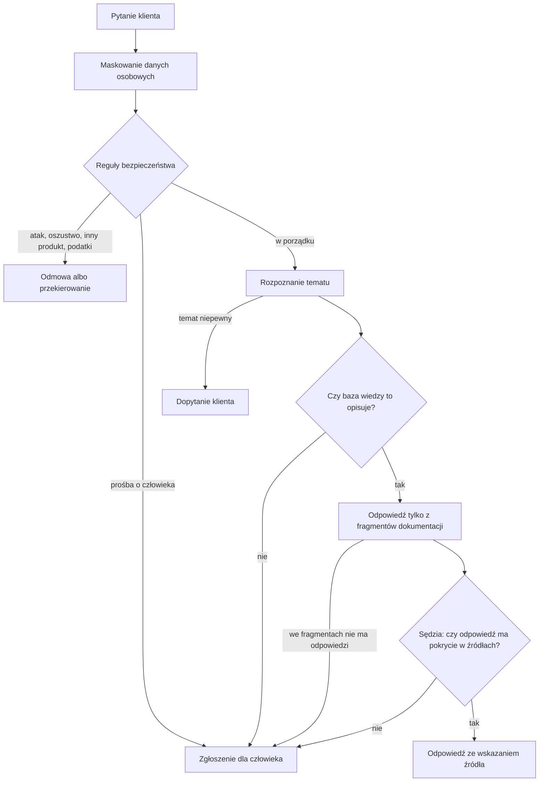

# kremzaPay Support Bot

[](https://github.com/aleksykremza-dev/kremzapay-support-bot/actions/workflows/ci.yml)
[](https://github.com/aleksykremza-dev/kremzapay-support-bot/releases)

Silnik bota wsparcia, który odpowiada klientom na podstawie Twojej dokumentacji
i nie zmyśla. Gdy nie zna odpowiedzi, mówi to wprost i zakłada zgłoszenie dla
człowieka.

[English version](README.en.md)

## Po co

Zrobiłem ten silnik, bo typowy czatbot na LLM odpowiada pewnie także wtedy, gdy
nie ma pojęcia. W obsłudze płatności to kosztuje: błędna informacja o zwrocie
kończy się reklamacją. Chciałem bota, który woli napisać „przekazuję sprawę
konsultantowi”, niż wymyślić odpowiedź.

Dlatego odpowiedź przechodzi kilka kontroli, zanim trafi do klienta, a każda
z nich może zatrzymać rozmowę i oddać ją człowiekowi. Przykładowa dziedzina to
obsługa płatności internetowych; `kremzaPay` to robocza nazwa projektu.

## Jak to działa



- **Dane osobowe** (karta, IBAN, PESEL, telefon, e-mail) są zamieniane na
  etykiety, zanim tekst zobaczy model, log albo baza.
- **Reguły** łapią próby manipulacji botem i prośby o pomoc w oszustwie bez
  udziału modelu, w ułamku milisekundy.
- **Temat** rozpoznaje porównanie z 5412 opisanymi pytaniami. Model językowy
  włącza się dopiero wtedy, gdy podobne pytania nie dają jednoznacznej odpowiedzi.
- **Odpowiedź** powstaje wyłącznie z trzech najlepszych fragmentów dokumentacji
  i kończy się linią `Źródło: <id artykułu>`.
- **Sędzia**, czyli drugie wywołanie modelu, sprawdza, czy fragmenty odpowiadają
  właśnie na to pytanie i czy każde twierdzenie ma w nich oparcie.

Szczegóły, progi i pliki: [docs/architektura.md](docs/architektura.md).

## Wyniki

Pomiary z 02.10 i 04.10.2026 na `qwen2.5:7b-instruct` i karcie GTX 1050 Ti 4 GB:

| Co mierzę | Wynik |
|---|---|
| Pytania spoza bazy wiedzy, które skończyły się zgłoszeniem, a nie zmyśloną odpowiedzią | 15 z 15 |
| Pytania z bazy, na które bot odpowiedział | 54 z 85, z czego 42 ze wskazaniem właściwego artykułu; pozostałe przekazał dalej |
| Trafność rozpoznania tematu na części testowej zbioru kontrolnego (192 pytania) | 0,755 |
| Mediana czasu odpowiedzi | 14,4 s (prawie cały czas to model; reguły, temat i wyszukiwanie trwają około 0,3 s) |
| Stabilność, 20 minut z zapytaniem co 20 s | pamięć +0,0 MB, otwarte pliki 10 -> 10 |
| Testy | 174 testy jednostkowe w CI przy każdej zmianie, testy na żywo: pytania spoza zakresu 22/22, rozpoznanie tematów 54/56 |

Pomiar na zewnętrznej bazie: 59 artykułów z tej samej dziedziny, ale innych niż
korpus, na którym budowałem rozpoznawanie tematów, i 100 pytań po polsku.
Wszystkie testy i scenariusze: [docs/testy.md](docs/testy.md).

## Szybki start

Potrzebne: Docker z Compose, [Ollama](https://ollama.com) z modelem
(`ollama pull qwen2.5:7b-instruct`) i artykuły w `kb/` (sekcja „Własna
dokumentacja” niżej).

```bash
git clone https://github.com/aleksykremza-dev/kremzapay-support-bot.git && cd kremzapay-support-bot
make up
make ingest
```

Czat: http://localhost:8020, panel: http://localhost:8020/dashboard, opis API:
http://localhost:8020/docs. Gotowy obraz:
`docker pull ghcr.io/aleksykremza-dev/kremzapay-support-bot:1.0.0`.

Pierwszy start trwa około 2 minut (pobranie modelu embeddingów i budowa indeksu),
kolejne kilkanaście sekund. Ollama w WSL, Ollama w kontenerze i instalacja bez
Dockera: [docs/instalacja.md](docs/instalacja.md).

## Własna dokumentacja

Artykuł to plik Markdown `kb/<kategoria>/<id>.md` z krótkim nagłówkiem:

```
---
id: KB-030
category: refunds
title: Gdzie jest mój zwrot
---

Zwrot na kartę trwa zwykle od 3 do 7 dni roboczych od zlecenia przez sprzedawcę.
```

Po każdej zmianie w artykułach: `make ingest`. Pełny format, kategorie
i przygotowanie bota pod inną dziedzinę niż płatności:
[docs/wlasna-domena.md](docs/wlasna-domena.md).

## Przekazanie człowiekowi

Gdy klient prosi o konsultanta albo bot nie ma pewnej odpowiedzi, powstaje zgłoszenie,
a klient dostaje jego numer. Przy prośbie o człowieka:

- zgłoszenie ma priorytet wysoki, a bot w tej rozmowie milknie: kolejne
  wiadomości klienta dopisują się do zgłoszenia;
- bot prosi o e-mail albo telefon i zapisuje je w oryginale tylko w zgłoszeniu,
  nigdzie indziej;
- w panelu na górze jest kolejka „Czeka na człowieka” z licznikiem i przyciskiem
  „Zamknij”.

Szczegóły i API: [docs/api.md](docs/api.md).

## Domyślnie i jak rozszerzyć

| | Domyślnie | Rozszerzenie |
|---|---|---|
| Model | lokalna Ollama, `qwen2.5:7b-instruct`, 0 zł za tokeny | inny model z Ollama jedną zmienną `ANSWER_MODEL` (jest); hostowany LLM, np. zgodny z OpenAI, wymaga zmiany jednego modułu `src/llm.py`; przy dużym ruchu to już koszt: własne GPU albo płatne API |
| Języki | polski i angielski | modele są wielojęzyczne, ale nowy język wymaga wykrywania języka, tekstów odpowiedzi, wzorców reguł i przykładowych pytań; warstwa tłumaczenia w planie |
| Wiedza | Markdown w `kb/` | PDF, strona WWW, REST, Confluence: w planie |
| Dziedzina | płatności jako przykład | własna taksonomia, korpus i zbiór kontrolny (jest, [opis](docs/wlasna-domena.md)); wymienne pakiety dziedzin w planie |
| Ruch | 2 pytania naraz na GTX 1050 Ti, nadmiar czeka do 30 s, potem dostaje 503 ze zgłoszeniem | limit w `.env` na mocniejszym sprzęcie (jest); vLLM, kilka procesów i Postgres dla 1000+ pytań na godzinę w planie |
| Panel | bez logowania, tylko lokalnie | logowanie i role w planie |
| Zgłoszenia | SQLite i panel | e-mail, helpdesk, CRM w planie |

## Ograniczenia

- Panel i zamykanie zgłoszeń nie mają logowania: uruchamiaj lokalnie albo za
  własnym uwierzytelnianiem.
- Na słabej karcie odpowiedź trwa od kilku do około 35 sekund.
- Trafność rozpoznania tematu 0,755; cel na kolejną wersję to 0,85.
- Jakość tekstu odpowiedzi kontroluje tylko sędzia tak/nie, nie jest osobno mierzona.

Pełna lista: [docs/architektura.md](docs/architektura.md#ograniczenia).

## Dlaczego w repozytorium nie ma bazy wiedzy

Silnik był rozwijany na prawdziwej dokumentacji, która należy do jej właściciela,
dlatego nie jest publikowana. Repozytorium zawiera silnik i instrukcję
podłączenia własnych artykułów.

## Dokumentacja

| Plik | Co w nim jest |
|---|---|
| [docs/architektura.md](docs/architektura.md) | etapy krok po kroku, progi, koszt jednego pytania, ograniczenia, mapa kodu |
| [docs/instalacja.md](docs/instalacja.md) | wymagania, instalacja bez Dockera, zmienne `.env`, Ollama w WSL i w kontenerze |
| [docs/wlasna-domena.md](docs/wlasna-domena.md) | format artykułów, własna taksonomia, korpus i zbiór kontrolny |
| [docs/api.md](docs/api.md) | endpointy, kształt odpowiedzi, limit równoległych żądań, zgłoszenia, przekazanie człowiekowi |
| [docs/testy.md](docs/testy.md) | cele `make`, progi, scenariusze ręczne, porównanie modeli, pomiary |
| [CHANGELOG.md](CHANGELOG.md) | zmiany w kolejnych wersjach |

## Licencja

[PolyForm Noncommercial 1.0.0](LICENSE), Copyright (c) 2026 Oleksii Kremza.
Użycie komercyjne wymaga wcześniejszej pisemnej zgody właściciela praw autorskich.
